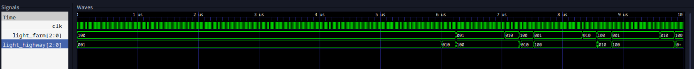
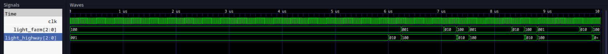
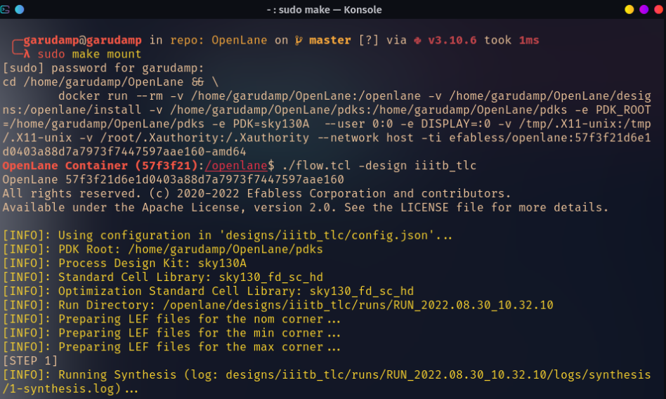

# iiitb_tlc -> traffic_light_controller
This repository contains design of a traffic light controlling module made using verlilog and simulation of the same.

## Introduction
Traffic lights are signaling devices used to manage traffic using different colours of light(Red, Green and Yellow). Usually we have two traffic light connected by same module working in sync. They are placed on cross-roads to avoid accidents and to maintain proper movement on roads. This model can be implemented using a microcontroller, programmable gate array or application specific IC. 

## Applications
Traffic lights are commonly used in
- places which are more crowded and have high risk of accidents
- places like schools and hospitals
- sometimes traffic lights are used to signal danger like places which are surrounded by fog

## Block Diagram
The block diagram of traffic light controller is shown below:
<p align="left">
  
</p>

## Functional characteristics

The design has five main parameters to it.<br>
The C button here is a sensor response, which will activate once any disturbance occurs on the area it is directed.<br>
The clock will keep track of time which can be used to decide the time to change the traffic signal.<br>
The reset button is used for initialisation of the whole process. As the whole system is autonomous, reset button won't be needed after first step.<br>
And then there are light_farm and light_highway parameters which will output the respective signals on two traffic light connected by sensor.<br>

## Required Tools and Installation Details

### iverilog

Icarus Verilog is a Verilog simulation and synthesis tool. It operates as a compiler, compiling source code written in Verilog (IEEE-1364) into some target format. For batch simulation, the compiler can generate an intermediate form called vvp assembly. This intermediate form is executed by the vvp command.

### GTKWave

GTKWave is a fully featured GTK+ based wave viewer for Unix and Win32 which reads LXT, LXT2, VZT, FST, and GHW files as well as standard Verilog VCD/EVCD files and allows their viewing. We will be using this tool to simulate the output of our main code using a testbench.

### Yosys

This is a framework for RTL synthesis tools. It currently has extensive Verilog-2005 support and provides a basic set of synthesis algorithms for various application domains.


### Instructions to Install above tools:

<ul>
  <li>
    <b> For Ubuntu/ Linux mint: </b> 
    <br>
    Open the terminal and enter the following commands
    
    
    $   sudo apt-get update
    $   sudo apt-get install iverilog 
    $   sudo apt-get install gtkwave
    $   sudo apt-get install yosys
    
  </li>
  <li>
    <b> For arch based distros: </b>
    <br>
    Open the terminal and enter the following commands
  
  
    $   sudo pacman -Syu
    $   sudo pacman -S iverilog 
    $   sudo pacman -S gtkwave
    $   sudo pacman -S yosys
    
  </li>
</ul>

### Functional Simulation

First, make sure to have git package installed in your device. Then proceed with following commands:

```
$   sudo apt install -y git
$   git clone https://github.com/m4ury4p/IIITB_ASIC_traffic_controller

$   cd IIITB_ASIC_traffic_controller/

$   iverilog iiitb_traffic_light_controller.v iiitb_traffic_light_controller_tb.v 
$   ./a.out

$   gtkwave pre_synthesis.vcd
```
I would recommend setting the interval of 10 microseconds and "zoom to fit" to see waveforms properly. 

###  Synthesis using Yosys

In computer engineering, logic synthesis is a process by which an abstract specification of desired circuit behavior, typically at register transfer level (RTL), is turned into a design implementation in terms of logic gates, typically by a computer program called a synthesis tool.<br>

<br>
Common examples of this process include synthesis of designs specified in hardware description languages, including VHDL and Verilog.Some synthesis tools generate bitstreams for programmable logic devices such as PALs or FPGAs, while others target the creation of ASICs. Logic synthesis is one aspect of electronic design automation.<br>

Yosys can be adapted to perform any synthesis job by combining the existing passes (algorithms) using synthesis scripts and adding additional passes as needed by extending the yosys C++ code base.<br>

Here, we will use following commands to run our script.

```
$   yosys
$   read_liberty -lib /lib/sky130_fd_sc_hd__tt_025C_1v80.lib
$   read_verilog iiitb_tlc.v
$   synth -top iiitb_tlc 
$   abc -liberty /home/iiitb_tlc/lib/sky130_fd_sc_hd__tt_025C_1v80.lib
$   write_verilog -noattr iiitb_tlc_synth.v
$   stat
$   show

```

### GLS - Gate Level Simulation

The term "gate level" refers to the netlist view of a circuit, usually produced by logic synthesis. So while RTL simulation is pre-synthesis, GLS is post-synthesis. The netlist view is a complete connection list consisting of gates and IP models with full functional and timing behavior. <br>
RTL simulation is a zero delay environment and events generally occur on the active clock edge. GLS can be zero delay also, but is more often used in unit delay or full timing mode. Events may be triggered by the clock, but will propagate according to the delays on each element. <br>
The loading and wiring delay models of the netlist can be estimated by the synthesis tools, or can be output from the layout tools. These delay models usually come in the form of an SDF (standard delay format) file.

To run Gate Level Simulation, run commands given below:

```
$   iverilog -DFUNCTIONAL -DUNIT_DELAY=#1 verilog_model/primitives.v verilog_model/sky130_fd_sc_hd.v iiitb_tlc_synth.v iiitb_tlc_tb.v
$   ./a.out
$   gtkwave post_synthesis.vcd

```
As we can see here , our pre and post synthesis outputs are same.

### Output Images

##  Pre synthesis:
<p align="left">
  
</p>

##  Post synthesis:
<p align="left">
  
</p>

### Simulation using OpenLane:

OpenLane is an automated RTL to GDSII flow based on several components including OpenROAD, Yosys, Magic, Netgen, CVC, SPEF-Extractor, CU-GR, Klayout and a number of custom scripts for design exploration and optimization. The flow performs full ASIC implementation steps from RTL all the way down to GDSII.

To install and test the tool, we can run following commands and tests:
```
 $git clone https://github.com/The-OpenROAD-Project/OpenLane.git
 
 $ cd OpenLane/
 
 $ sudo make
 
 $ sudo make test

```

### Magic:

Magic is an electronic design automation (EDA) layout tool for very-large-scale integration (VLSI) integrated circuit (IC) originally written by John Ousterhout and his graduate students at UC Berkeley.<br>

Magic features real-time design rule checking, something that some costly commercial VLSI design software packages don't feature. Magic implements this by counting distance using Manhattan distance rather than Euclidean distance, which is much faster to compute.

To install this tool,we need to install some packages listed below:
```
$   sudo apt-get install m4
$   sudo apt-get install tcsh
$   sudo apt-get install csh
$   sudo apt-get install libx11-dev
$   sudo apt-get install tcl-dev tk-dev
$   sudo apt-get install libcairo2-dev
$   sudo apt-get install mesa-common-dev libglu1-mesa-dev
$   sudo apt-get install libncurses-dev
```
Then, we install magic tool:

```
$ git clone https://github.com/RTimothyEdwards/magic
$ cd magic/
$ ./configure
$ sudo make
$ sudo make install
```
Then we can type magic in terminal to verify if our installation was successful or not.

### Simulating Layout:

To simulate the layout, we  will follow the steps shown below:

```
$ cd /OpenLane/designs
$ mkdir iiitb_tlc
$ touch config.json
$ cd iiitb_tlc
$ mv $HOME/iiitb_tlc/config.json OpenLane/designs/iiitb_tlc/config.json
```
Then, copy the src directory from home/iiitb_tlc and paste it in openlane/designs/iiitb_tlc.<br>
After that, run the following commands:
```
$ cd OpenLane
$ sudo make mount
$ ./flow.tcl -design iiitb_tlc

```
So, the output looks like

<p align="left">
  
</p>


## Contributors

- <b> Maurya Patel </b>
- <b> Kunal Ghosh </b>

## Acknowledgements

- Kunal Ghosh, Director, VSD Corp. Pvt. Ltd.

## Contact Information

- Maurya Patel, Integrated MTech ECE Student, International Institute of Information Technology, Bangalore Maurya.Patel@iiitb.ac.in
- Kunal Ghosh, Director, VSD Corp. Pvt. Ltd. kunalghosh@gmail.com

## References
- https://www.fpga4student.com/2016/11/verilog-code-for-traffic-light-system.html
- https://www.academia.edu/21200096/DESIGN_AND_IMPLEMENTATION_OF_TRAFFIC_LIGHTS_CONTROLLER_USING_FPGA_A_Project_Based_Laboratory_Report_in_partial_fulfilment_for_the_award_of_III_IV_B_Tech_I_Semester_Submitted_by_Lab_Instructor
- https://iverilog.fandom.com/wiki/GTKWave
- https://en.wikipedia.org/wiki/Logic_synthesis
